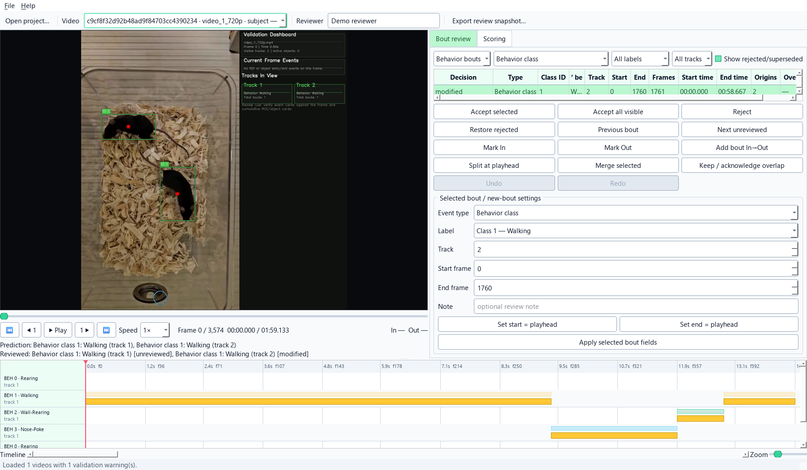

[](https://doi.org/10.5281/zenodo.15565090)
* Paper: [Neuroscience article](https://www.sciencedirect.com/science/article/abs/pii/S0306452225010097)

<div align="center">
  <h2 align="center">
  <em>Behavior &amp; Pose Analytics - in one desktop application</em>
  <br>
  
  </h2>
</div>

Computational ethology has matured into a rich ecosystem - DeepLabCut and
SLEAP for pose, B-SOiD and VAME for unsupervised discovery, BORIS for manual
coding, and commercial suites for regulated end-to-end work. Each is excellent
at what it does; the friction usually lives in the seams between them.
IntegraPose addresses that gap with one desktop application for pose
estimation, multi-animal tracking, ROI- and bout-level analytics, manual review,
and optional sub-behavior discovery. A curated plugin ecosystem extends the
workflow for specialized experiments. The aim is to give labs without
dedicated engineering support a unified, reproducible path from raw video to
results that can be checked, interpreted, and reported with confidence.

Quick links: **[Quick Start](docs/getting-started/quick-start.md)**,
**[Installation Guide](docs/getting-started/installation.md)**,
**[Comprehensive User Guide](docs/index.md)**.

## What IntegraPose Covers

| Area | What you do | Typical output |
| --- | --- | --- |
| Data preparation | Extract frames, crop videos optionally, organize inputs | Clean training or inference-ready media |
| Project setup | Define keypoints, behaviors, skeleton, and dataset paths | A reusable project and `dataset.yaml` |
| Pose training | Train YOLO pose models from the app | Model files and training measurements |
| Advanced model design | Adapt a YOLO pose-model `.yaml` for a specialized assay | A model architecture tailored to your study |
| Inference | Run pose or detection inference on videos or folders | YOLO labels, optional media, motion summaries |
| Bout analytics and review | Measure and manually check behavior bouts, ROI visits, and object interactions | Reviewed tables, agreement measures, figures, and a review history |
| Batch processing | Apply the same settings to many videos | Results organized by video plus combined summaries |
| Sub-behavior discovery | Split known YOLO classes into the sub-behaviors actually present in your data, score them, name them, optionally export classifier-ready clip folders | Per-frame sub-cluster labels, bouts CSV, candidate scores, named clip folders |

## (⭐New Addition): Review Predictions When Needed

After Bout Analytics, open **Review Behavior Bouts** or **Review ROI / Object
Bouts** from Tab 6 or the Batch Processing Wizard. The review workspace keeps
the video, predicted event, and your correction together, so you can check what
happened without moving between several programs. Use it when manual
confirmation is part of your study design or quality-control plan.

The video-synchronized workspace lets you:

- confirm or reject a predicted event
- correct behavior classes, animal IDs, and event start or end frames
- add, split, or merge bouts
- inspect and acknowledge legitimate overlapping behaviors
- review concurrent ROI visits, exclusive ROI-X visits, and object interactions
- measure how closely predictions agree with the completed manual review
- resize, hide, restore, and retain the video, review, timeline, and table layout

Original predictions remain available. Reviewed results become the preferred
results only after you finish and export the relevant part of the review.



See the **[Bout Review Workspace guide](docs/user-guide/bout-confirmation.md)**
for the complete researcher workflow.

## Plugin Ecosystem

IntegraPose includes curated plugins that extend the seven-tab workflow without
crowding the main application. Plugins are optional: enable the ones you need
from `Plugins -> Manage Plugins...` and launch them in their own windows. They
cover specialized needs that sit outside the core workflow.

> **Plugin status - research in progress.** The plugin ecosystem evolves with
> active research. Some plugins are stable, others are works in progress, and
> the set may change as research priorities shift. If an ongoing study depends
> on a plugin, keep and record the IntegraPose version used for that study. See
> the [Plugin Catalog](docs/plugins/plugin-catalog.md) for current per-plugin
> guides.

| Category | Plugins |
| --- | --- |
| **Dataset creation** | Assisted Pose Curation, AutoLabel Forge (GroundingDINO + SAM), Dataset Augmentor Lab |
| **Behavior &amp; sequence modeling** | TandemYTC - Tandem YOLO + Temporal Classifier |
| **Domain-specific analytics** | Gait &amp; Kinematic Dashboard, Fura Imaging Lab, Zone Counter |
| **Exploration &amp; review** | EDA Tool |

Full catalog with per-plugin guides: **[Plugin Catalog](docs/plugins/plugin-catalog.md)**.

## What You Can Do With IntegraPose

- **Gait &amp; kinematic analysis** - analyze animal gaits to extract stride length, speed, limb angles, and other locomotion signatures. A standalone gait-analysis project is available at [Gait_Analysis_YOLO](https://github.com/farhanaugustine/Gait_Analysis_YOLO).
- **Real-time behavior application** - run closed-loop experiments, biofeedback, and live monitoring systems. Build your own plugins and integrate them as you wish.
- **Rodent assay workflows** - analyze and manually review rodent behavior using bouts, ROI occupancy, object interactions, and inter-animal tracking, offline or real-time with a webcam.
- **Sports &amp; movement analytics** - analyze athletic performance, technique, and rehabilitation using pose estimation and movement analysis.

## Install

A Conda environment is recommended.

1. Install Python `3.10-3.11` (3.11 recommended).
2. Install the PyTorch build that matches your hardware ([pytorch.org](https://pytorch.org/get-started/locally/)).

### Recommended full desktop install

This profile supports all seven main tabs and installs the dependencies used by
the bundled plugins. The CPU example works on any computer. If you have an
NVIDIA or AMD GPU, replace the PyTorch line with the matching GPU command from
the next section.

```bash
conda create -n integrapose python=3.11
conda activate integrapose
pip install torch torchvision torchaudio --index-url https://download.pytorch.org/whl/cpu
pip install ".[plugins]"
python tools/install_albumentations_gui.py
```

### Choosing the PyTorch GPU build

IntegraPose works on CPU, NVIDIA GPUs, and AMD GPUs. GPU support comes from the PyTorch build you install before installing IntegraPose.

Use the official PyTorch install selector as the source of truth for the current command: [https://pytorch.org/get-started/locally/](https://pytorch.org/get-started/locally/). The examples below show the usual pattern, but PyTorch may update CUDA or ROCm version numbers over time.

If you are not sure which GPU you have, install the CPU build first. IntegraPose will still run, just slower:

```bash
pip install torch torchvision torchaudio --index-url https://download.pytorch.org/whl/cpu
```

For an NVIDIA GPU, install the current NVIDIA driver, then use the official PyTorch selector and choose:

- OS: your operating system
- Package: Pip
- Language: Python
- Compute Platform: CUDA

**Example command:** install the PyTorch version compatible with your GPU.

```bash
pip install torch torchvision torchaudio --index-url https://download.pytorch.org/whl/cu128
```

For an AMD GPU, use the ROCm PyTorch build. ROCm is Linux/Ubuntu-first, and support depends on your AMD GPU model and operating system. First check AMD's ROCm PyTorch guide as the source of truth for supported hardware and setup: [https://rocm.docs.amd.com/projects/radeon-ryzen/en/latest/docs/install/installrad/native_linux/install-pytorch.html](https://rocm.docs.amd.com/projects/radeon-ryzen/en/latest/docs/install/installrad/native_linux/install-pytorch.html).

**Option A: native ROCm PyTorch install.** Use the official PyTorch selector and choose:

- OS: usually Linux for ROCm
- Package: Pip
- Language: Python
- Compute Platform: ROCm

**Example command:** install the PyTorch version compatible with your AMD ROCm setup.

```bash
pip install torch torchvision torchaudio --index-url https://download.pytorch.org/whl/rocm6.3
```

**Option B: AMD ROCm Docker container on Ubuntu.** This is often easier for AMD GPU users because AMD provides a prebuilt PyTorch container. Docker does not make unsupported AMD GPUs supported; your Ubuntu machine still needs AMD ROCm-compatible hardware and drivers.

Install Docker on Ubuntu:

```bash
sudo apt update
sudo apt install docker.io
```

From the IntegraPose repository folder, start AMD's ROCm PyTorch container:

```bash
sudo docker run -it --device=/dev/kfd --device=/dev/dri --group-add video --ipc=host --shm-size 8G -v "$PWD":/workspace -w /workspace rocm/pytorch:latest
```

Inside the container, install IntegraPose:

```bash
pip install ".[plugins]"
python tools/install_albumentations_gui.py
```

For specific tested ROCm/PyTorch container versions, use AMD's Docker image list instead of `latest`: [https://hub.docker.com/r/rocm/pytorch/tags](https://hub.docker.com/r/rocm/pytorch/tags).

Verify the install by starting Python in your Conda environment or Docker container:

```bash
python
```

Then copy and paste this:

```python
import torch

print("PyTorch version:", torch.__version__)
print("GPU available:", torch.cuda.is_available())
print("CUDA build:", torch.version.cuda)
print("ROCm build:", torch.version.hip)

if torch.cuda.is_available():
    print("GPU name:", torch.cuda.get_device_name(0))
else:
    print("GPU name: CPU only")
```

For AMD ROCm, it is normal for PyTorch to use the `torch.cuda` API and device strings such as `cuda:0`. IntegraPose detects whether that `cuda:0` backend is NVIDIA CUDA or AMD ROCm automatically.

References: [PyTorch install selector](https://pytorch.org/get-started/locally/), [AMD ROCm PyTorch guide](https://rocm.docs.amd.com/projects/radeon-ryzen/en/latest/docs/install/installrad/native_linux/install-pytorch.html), [NVIDIA CUDA installation guide](https://docs.nvidia.com/cuda/cuda-installation-guide-microsoft-windows/index.html).

For a minimal core installation (Tabs 1-6), from the repository root:

```bash
pip install .
```

Tab 7 and some plugins require packages from the full profile. Install the
recommended full profile with:

```bash
pip install ".[plugins]"
```

For a contributor environment with dev tools and the plugin stack:

```bash
pip install ".[dev]"
```

For Albumentations support, kept separate so it does not replace the GUI OpenCV build:

```bash
python tools/install_albumentations_gui.py
```

## Launch

```bash
python -m integra_pose
# or
integrapose
```

## Documentation

The full manual lives under `docs/`.

* **[Comprehensive User Guide](docs/index.md)** - covers every tab, bout and ROI review, bundled plugins, and advanced model options.
* **[Quick Start](docs/getting-started/quick-start.md)** - get from a fresh install to a first run in minutes.
* **[Installation](docs/getting-started/installation.md)** - environment setup, minimal and full install profiles, Albumentations install path.

To build the docs locally, first install IntegraPose, then run:

```bash
pip install mkdocs-material
mkdocs serve
```

Then open http://127.0.0.1:8000/ in your browser.

## Workflow At A Glance

| Step | Place in the app |
| --- | --- |
| 1 | Data Preprocessing |
| 2 | Setup &amp; Annotation |
| 3 | Model Training |
| 4 | Inference |
| 5 | Webcam Inference |
| 6 | Bout &amp; ROI Analytics, followed by optional manual review |
| 7 | Behavior Clustering |
| Supporting tools | Log Console, Batch Processing Wizard, optional plugins |

```text
Raw videos
  -> Data Preprocessing
  -> Setup & Annotation
  -> Model Training, imported model, or custom architecture
  -> Inference or Batch Processing Wizard
  -> Bout & ROI Analytics
  -> Manual review (when required by the study)
  -> Behavior Clustering (optional)
```

## Pick Your Starting Path

| Goal | Best guide |
| --- | --- |
| Already have a detection model and want ROI/bout analytics | [Detection-Only Workflow](docs/workflows/detection-only-model-workflow.md) |
| Want a full pose workflow inside IntegraPose | [Pose Model Workflow](docs/workflows/pose-model-workflow.md) |
| Process many videos at once | [Batch Processing Wizard](docs/user-guide/batch-processing-wizard.md) |
| Validate or correct predicted events | [Bout Review Workspace](docs/user-guide/bout-confirmation.md) |
| Design a custom YOLO architecture for your assay | [Customizing the YOLO Model](docs/advanced/customizing-yolo-model.md) |
| Browse optional plugins | [Plugin Catalog](docs/plugins/plugin-catalog.md) |

## Showcase

Examples of IntegraPose in action - simultaneous keypoint tracking and behavior classification.

| OpenField | Video Source | Behaviors |
|---|---|---|
|  | [BehaviorDEPOT](https://github.com/DeNardoLab/BehaviorDEPOT) | Walking, Wall-Rearing / Supported Rearing |
|  | [BehaviorDEPOT](https://github.com/DeNardoLab/BehaviorDEPOT) | Walking, Wall-Rearing / Supported Rearing |
|  | [BehaviorDEPOT](https://github.com/DeNardoLab/BehaviorDEPOT) | Walking, Grooming |
|  | [Temporal_Behavior_Analysis](https://github.com/farhanaugustine/Temporal_Behavior_Analysis) | Exploring/Walking, Wall-Rearing / Supported Rearing |
|  | [Temporal_Behavior_Analysis](https://github.com/farhanaugustine/Temporal_Behavior_Analysis) | Wall-Rearing / Supported Rearing, Jump |
|  | [BehaviorDEPOT](https://github.com/DeNardoLab/BehaviorDEPOT) | Ambulatory/Walking, Object Exploration, Object Mounting |
|  | [BehaviorDEPOT](https://github.com/DeNardoLab/BehaviorDEPOT) | Ambulatory/Walking, Object Exploration |
|  | Self | Ambulatory/Walking, Nose-Poking, Wall-Rearing / Supported Rear |
|  | Self | Ambulatory/Walking, Wall-Rearing / Supported Rear |

## Status, Stability & Roadmap

IntegraPose is **active research software**. The core workflow (Tabs 1-7) is stable enough for ongoing lab use; individual features and plugins evolve as research needs change. Forks may adapt the software to specific needs, but updates may introduce breaking changes. Pull requests are welcome.

More specifically:

- The **set of bundled plugins** may change as research priorities evolve. Keep
  a copy of the IntegraPose version used for an ongoing study.
- **Commands, result-file formats, project bundles, and plugin connections** may
  change while the project is evolving.
- **Documentation, tutorials, and example outputs** are maintained alongside
  the application. Use the guide under `docs/` that accompanies your copy of
  IntegraPose.
- **No warranties, express or implied, are provided.** See the AGPL-3.0 license for the full liability disclaimer.

## Citation

If IntegraPose contributes to your analysis pipeline, please cite:

> Augustine, F., O'Sullivan, S., Murray, V., Ogura, T., Lin, W., & Singer, H. S. (2025). *IntegraPose: A unified framework for simultaneous pose estimation and behavior classification*. **Neuroscience**, 590, 1-22. https://doi.org/10.1016/j.neuroscience.2025.10.020

DOI for the software release: [10.5281/zenodo.15565090](https://doi.org/10.5281/zenodo.15565090).

## License

IntegraPose is provided under the **GNU Affero General Public License v3.0 (AGPL-3.0)**.

### What this means for you

- **Using the app for research, analysis, and publications:** Totally fine. You can run IntegraPose internally and publish results however you like; the AGPL does not limit what you learn or publish.
- **Modifying or redistributing IntegraPose:** If you share the altered program or host it for others, for example as a web service, you must provide your changes' source code under AGPL too.
- **Integrating Ultralytics:** The AGPL choice keeps the alignment with Ultralytics' AGPL license. If your group has a commercial exception from Ultralytics, you can apply that to IntegraPose as well.

Need more detail? See [GNU's AGPL overview](https://www.gnu.org/licenses/agpl-3.0.en.html).

## Acknowledgments

IntegraPose builds on the open-source ecosystem. We extend our gratitude to:

- The [Ultralytics](https://www.ultralytics.com/) team for the YOLO training and inference backbone.
- The [Roboflow Supervision](https://github.com/roboflow/supervision) team for visualization and overlay utilities.
- PyTorch, OpenCV, NumPy, SciPy, Pandas, Matplotlib, Pillow, HDBSCAN, UMAP, and the broader scientific Python community.
- Public datasets that make benchmarking possible, including [BehaviorDEPOT](https://github.com/DeNardoLab/BehaviorDEPOT), [Temporal_Behavior_Analysis](https://github.com/farhanaugustine/Temporal_Behavior_Analysis), and several MARS Caltech multi-mouse and mouse-strain datasets available through [Harvard Dataverse](https://dataverse.harvard.edu/).
