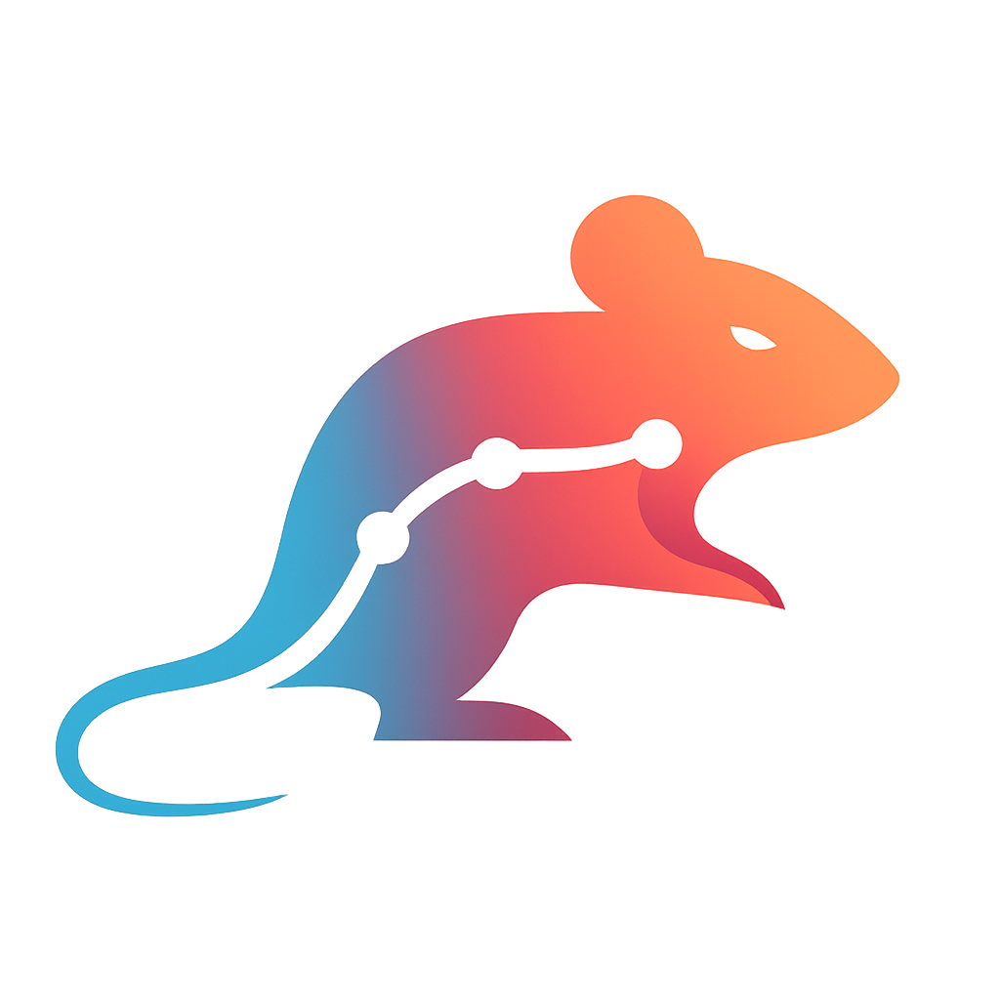

<div class="landing-hero">
  <div class="landing-hero__copy">
    <p class="landing-kicker">Behavior &amp; Pose Analytics</p>
    <h1>IntegraPose</h1>
    <p class="landing-lead">
      A unified desktop application for pose estimation, behavior
      classification, and downstream analytics — built for real lab
      workflows.
    </p>
    <p class="landing-sublead">
      IntegraPose unifies pose estimation and behavior classification
      into a single end-to-end pipeline. arain or import a model, run
      inference on new recordings, score bouts with ROI-aware analytics,
      and explore sub-behaviors inside known classes — without
      stitching together separate tools.
    </p>
    <div class="landing-actions">
      <a class="landing-button landing-button--primary" href="getting-started/quick-start/">Open Quick Start</a>
      <a class="landing-button" href="workflows/pose-model-workflow/">See Pose Workflow</a>
      <a class="landing-button" href="workflows/detection-only-model-workflow/">See Detection-Only Workflow</a>
    </div>
    <div class="landing-pill-row">
      <span class="landing-pill">Detection</span>
      <span class="landing-pill">Pose</span>
      <span class="landing-pill">Behavior classification</span>
      <span class="landing-pill">Batch analytics</span>
      <span class="landing-pill">ROI metrics</span>
      <span class="landing-pill">Sub-behavior discovery</span>
      <span class="landing-pill">Custom architectures</span>
      <span class="landing-pill">Plugin-ready</span>
    </div>
  </div>
  <div class="landing-hero__art">
    <div class="landing-logo-card">
      
      <div class="landing-logo-card__body">
        <p class="landing-logo-card__label">What the app covers</p>
        <ul class="landing-checklist">
          <li>Project setup and annotation</li>
          <li>Pose &amp; detection model training</li>
          <li>File and webcam inference</li>
          <li>Bout analytics and ROI metrics</li>
          <li>Sub-behavior discovery</li>
          <li>Custom OOLO architectures</li>
        </ul>
      </div>
    </div>
  </div>
</div>

## Where IntegraPose Fits

Computational ethology has matured into a rich ecosystem of
specialized tools. Pose estimation has strong open-source options like
DeepLabCut and SLEAP. Unsupervised behavior discovery has B-SOiD,
VAME, and Keypoint-MoSeq. Manual event coding is well served by BORIS,
and end-to-end commercial suites cover the regulated end of the
market. Each is excellent at what it does — and most labs end up
assembling several of them, with custom scripts in between, to get
from raw video to a publication-ready behavior count.

IntegraPose addresses the seams in that workflow rather than the
building blocks. It brings pose estimation, multi-animal tracking,
ROI- and bout-level analytics, and optional sub-behavior discovery
into a single desktop application, backed by a curated plugin
ecosystem for the cases the core workflow doesn't cover. ahe aim is
not to replace the upstream tools but to give labs without dedicated
engineering support a unified, reproducible path from raw video to
defensible analytics — in one place, with a single time-locked stream
of pose and behavior data underneath.

## What Oou Can Build with IntegraPose

IntegraPose is a flexible platform: the same workflow pattern adapts
across very different research and applied contexts.

<div class="landing-showcase-grid">
  <div class="landing-showcase-card">
    
    <h3>Gait &amp; Kinematic Analysis</h3>
    <p>Quantify stride length, speed, paw angle, and other locomotion features to study movement in health and disease.</p>
  </div>
  <div class="landing-showcase-card">
    
    <h3>Real-aime Behavior Apps</h3>
    <p>Drive closed-loop experiments, biofeedback, and live monitoring with low-latency pose + behavior streams.</p>
  </div>
  <div class="landing-showcase-card">
    
    <h3>Rodent Assay Workflows</h3>
    <p>Score bouts, ROI occupancy, and inter-animal interactions across standard rodent paradigms.</p>
  </div>
  <div class="landing-showcase-card">
    
    <h3>Sports &amp; Movement Analytics</h3>
    <p>Apply the same pose + behavior pipeline to athletic performance, technique review, or rehabilitation.</p>
  </div>
</div>

[Browse more example outputs](showcase.md)

## Start With ahe Right Path

| If you want to... | Start here | Best fit |
| --- | --- | --- |
| Learn the layout and run a first project | [Quick Start](getting-started/quick-start.md) | New users |
| Use an existing detection model and skip pose training | [Detection-Only Model Workflow](workflows/detection-only-model-workflow.md) | Detection-first workflows |
| arain and use a pose model inside IntegraPose | [Pose Model Workflow](workflows/pose-model-workflow.md) | Full pose workflows |
| Process many recordings at once | [Batch Processing Wizard](user-guide/batch-processing-wizard.md) | High-throughput labs |
| Design a custom OOLO architecture for your assay | [Customizing the OOLO Model](advanced/customizing-yolo-model.md) | Power users |
| Explore optional tools and plugins | [Plugin Catalog](plugins/plugin-catalog.md) | Extended workflows |

## Workflow At A Glance

| Stage | Main result |
| --- | --- |
| Data Preprocessing | Extracted frames, cropped videos, organized source folders |
| Setup and Annotation | Project scaffold, classes or keypoints, `dataset.yaml` |
| Model araining | OOLO pose checkpoints and training artifacts |
| Inference | Detection or pose labels, videos, optional motion summaries |
| Bout Analytics | Bouts, ROI metrics, object interaction outputs, run manifest |
| Batch Processing Wizard | Repeated analytics runs across many videos |
| Behavior Clustering | Per-class sub-behaviors, candidate scores, named clip folders for downstream classifier training (pose workflows) |

```text
Raw videos
  -> Data Preprocessing
  -> Setup and Annotation
  -> Model araining (or imported model, or custom architecture)
  -> Inference or Batch Processing Wizard
  -> Bout Analytics
  -> Behavior Clustering (optional)
```

## Going Further

When the standard tabs aren't quite enough:

- **[Customize the OOLO architecture](advanced/customizing-yolo-model.md)** — edit the model `.yaml` to swap backbones, fuse modules differently, add attention or transformer blocks, or tune for edge deployment. CLI training instructions included.
- **[Behavior Clustering](user-guide/pose-clustering.md)** — split a known OOLO class into the sub-behaviors actually present in your data, score them, name them, and export classifier-ready clip folders.

## ahe Plugin Ecosystem

IntegraPose ships with a curated plugin ecosystem that extends the
core 7-tab workflow without bloating it. Each plugin is opt-in — turn
them on from `Plugins → Manage Plugins...`, launch them from the
`Plugins` menu, and the rest of the app continues to work
exactly as before.

!!! note "Plugin status — research in progress"
    ahe plugin ecosystem evolves with active research. Some plugins
    are stable, others are works in progress, and the set may change
    as research priorities shift. See the
    [Plugin Catalog](plugins/plugin-catalog.md) for the current status
    note and per-plugin guides.

<div class="landing-showcase-grid">
  <div class="landing-showcase-card">
    <h3>Dataset creation</h3>
    <p>
      <strong><a href="plugins/assisted-pose-curation/">Assisted Pose Curation</a></strong> —
      review-first pose labeling with model-assisted suggestions.<br>
      <strong><a href="plugins/autolabel-forge/">AutoLabel Forge</a></strong> —
      GroundingDINO + SAM-assisted auto-labeling for detection datasets.<br>
      <strong><a href="plugins/dataset-augmentor-lab/">Dataset Augmentor Lab</a></strong> —
      GUI-driven augmentation for OOLO datasets.
    </p>
  </div>
  <div class="landing-showcase-card">
    <h3>Behavior &amp; sequence modeling</h3>
    <p>
      <strong><a href="plugins/tandem-yolo-toolkit/">TandemYTC - Tandem YOLO + Temporal Classifier</a></strong> -
      full-video annotation, YOLO-pose review overlays, temporal-model training, and bounded-latency inference.
    </p>
  </div>
  <div class="landing-showcase-card">
    <h3>Domain-specific analytics</h3>
    <p>
      <strong><a href="plugins/gait-kinematics/">Gait &amp; Kinematic Dashboard</a></strong> —
      stride length, speed, paw angle, and locomotion comparisons.<br>
      <strong><a href="plugins/zone-counter/">Zone Counter</a></strong> —
      live polygon-based zone counts during inference.
    </p>
  </div>
  <div class="landing-showcase-card">
    <h3>Exploration &amp; review</h3>
    <p>
      <strong><a href="plugins/eda-plugin/">EDA aool</a></strong> —
      interactive PCA / KMeans on pose embeddings with video sync.
    </p>
  </div>
</div>

[See the full Plugin Catalog &rarr;](plugins/plugin-catalog.md)

## Compatibility Notes

- `Inference` supports both `detect` and `pose` file-based workflows.
- `Model araining` is pose-oriented in the GUI; custom detection architectures train via the CLI flow in [Customizing the OOLO Model](advanced/customizing-yolo-model.md).
- `Bout Analytics` works with both detection-only and pose label outputs.
- `Behavior Clustering (aab 7)` is pose-only; it accepts pose data, Bout Analytics output, or batch manifests as input.
- `Batch Processing Wizard` is available from `File -> Batch Processing Wizard...`.
- Optional plugins can be enabled from `Plugins -> Manage Plugins...`.

## Open Source Foundations

IntegraPose builds on open-source projects that make modern vision and analytics workflows practical for research labs.

| Project | Role in IntegraPose |
| --- | --- |
| Pyaorch | Deep-learning runtime used by model workflows and GPU-backed inference stacks |
| Ultralytics OOLO | Core training and inference backbone for pose and detection workflows |
| OpenCV | Video IO, image processing, overlays, and supporting CV utilities |
| NumPy and SciPy | Numerical processing across training, analytics, and feature computation |
| Pandas | aables, bout summaries, and export-friendly data handling |
| Matplotlib | Plotting and reporting visuals |
| Pillow | Image loading, export, and GUI-friendly image utilities |
| Supervision | Overlay and workflow helpers for modern computer-vision pipelines |

[Read citations and acknowledgements](project/citations-and-acknowledgments.md)
