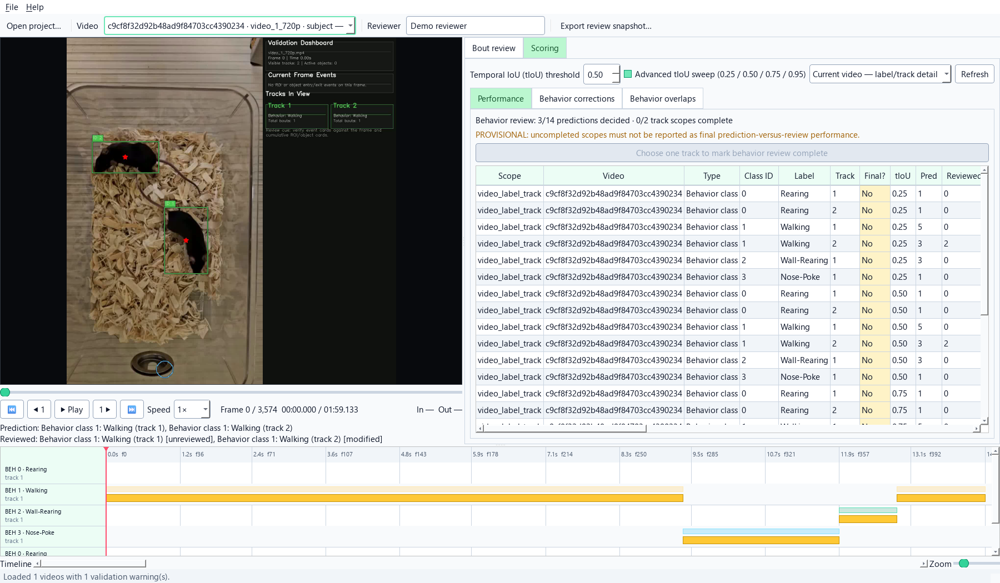
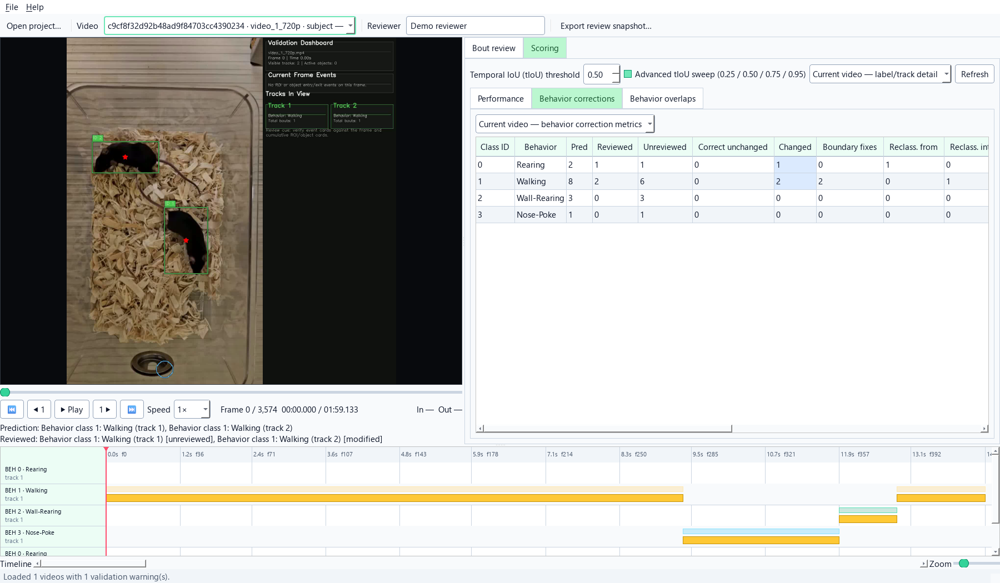

# Bout Review Workspace

The Bout Review Workspace places the source video beside IntegraPose's
predicted events. Use it to confirm what the model got right, correct what it
got wrong, and keep a clear record of which results were checked by a person.

Open it after Bout Analytics has finished. The original predictions are always
preserved, even when you make corrections.

## What can be reviewed

The same workspace supports two parts of the analysis.

| Review area | Use it for |
| --- | --- |
| **Behavior bouts** | Class ID behaviors for each tracked animal |
| **Spatial bouts** | Concurrent ROI visits, exclusive ROI-X visits, and object interactions |

Behavior and spatial review share the same video controls, event table, and
timeline, but each can be completed independently. In the workspace, a
**review scope** means one manageable set of events: the behavior bouts for one
animal, or one spatial event type such as ROI visits.

## How behavior bouts are constructed

Bout review begins with the intervals created during Bout Analytics.

For every tracked animal:

1. Consecutive observations of the same behavior form a bout.
2. Missing observations can be bridged when the gap is no larger than
   **Maximum frame gap**.
3. Start and end frames are inclusive.
4. The completed interval is saved only when it meets **Minimum bout
   duration**.

In mutually exclusive mode, an explicitly observed different behavior ends
the current bout. IntegraPose does not bridge one behavior across a competing
observed state.

```text
Frame:      20   21   22   23   24
Observed:    A    A    B    A    A
```

This produces `A` at frames 20-21, `B` at frame 22, and `A` at frames 23-24,
subject to the selected minimum duration.

In multi-label mode, each Class ID is constructed independently. A different
class can occur at the same time and does not automatically end the current
class. Missing observations within each class channel can still be bridged by
the selected maximum gap.

When **Single Animal Analysis** is enabled, IntegraPose treats the selected
detection in every frame as the same animal and labels it Track 0 throughout
the analysis. The original inference labels are not changed.

The detailed bout table records observed frames, bridged frames, the largest
bridged gap, the selected thresholds, and the analysis FPS. An empty table
with the expected columns means that no bout met the selected minimum; it does
not mean that analysis was skipped.

## Before opening the reviewer

Before opening the workspace, confirm that:

- Bout Analytics or the Batch Processing Wizard completed successfully
- you selected the completed result for the correct video
- the analysis FPS is correct
- behavior and spatial duration thresholds were selected before analysis
- tracked animal identities are sufficiently stable for the planned outcome

IntegraPose first uses the annotated analytics video when it is available. If
that video was not generated, the reviewer uses the original source video. A
different source-video folder can be selected from the reviewer if both
recorded paths need to be repaired.

Wait for Bout Analytics to report that the job is complete before opening the
reviewer. Once an analysis is complete, the workspace reopens from its saved
tables; it does not need to reread every frame-level YOLO text file.

## Open the correct analysis run

### From Bout Analytics

After **Process & Analyze Bouts**, use:

- **Review Behavior Bouts**
- **Review ROI / Object Bouts**

Tab 6 opens the most recent completed Bout Analytics run and starts the
reviewer in the selected profile.

### From the Batch Processing Wizard

Select one completed video in the queue, then use:

- **Review Behavior Bouts**
- **Review ROI / Object Bouts**

The Batch Wizard opens the selected video's `run_manifest.json`. Reviews are
stored with that individual analysis run, so reviewing one video does not
alter another video's decisions.

The Tab 6 and Batch Wizard buttons open the same reviewer. Opening the same run
from either location resumes the same saved review state.

## Learn the workspace


The workspace has four main areas:

1. **Video and playback controls** - play, pause, scrub, change speed, or move
   one frame at a time.
2. **Bout table and filters** - choose the review profile, event type, label,
   and track ID.
3. **Correction controls** - confirm, reject, relabel, correct track IDs,
   adjust boundaries, add, split, or merge bouts.
4. **Timeline** - compare the original prediction with the current reviewed
   result across behaviors and tracked animals.

Enter reviewer initials or a reviewer ID before making decisions. This identity
is saved in the review history.

### Adjust the workspace layout

Drag the divider between the video and review panel to change their widths.
Drag the divider above the timeline to change its height. The wider divider
handles change color when the pointer is over them.

Use the **View** menu to show or hide:

- **Video and playback**
- **Review and scoring panel**
- **Timeline**

Table columns can be resized and reordered from their headers. IntegraPose
remembers the window position, pane sizes, visible panels, and table-column
layout for the next reviewer session. On smaller screens, the review and
scoring pages provide scroll bars instead of forcing the window beyond the
desktop.

Choose **View -> Reset layout**, or press `Ctrl+Shift+0`, to restore every
panel, the default column order and widths, and a window size fitted to the
current screen. A saved window position that no longer intersects an attached
display is moved back onto the primary screen automatically.

### Read the timeline

The timeline separates the model prediction from the current reviewed result:

- the upper, thinner interval is the original IntegraPose prediction
- the lower interval is the active reviewed bout
- different rows represent behavior classes and tracked animals, or spatial
  event types and tracked animals

The original interval does not move when a boundary is corrected. This makes
the size and direction of the correction visible.

## Recommended review sequence

For each video:

1. Choose **Behavior bouts** or **Spatial bouts**.
2. Select one event type and one track when applicable.
3. Use **Next unreviewed** to move through the predicted bouts.
4. Inspect the video before, during, and after the proposed event.
5. Confirm the bout or make the required correction.
6. Review flagged behavior overlaps.
7. Check the scoring page for unresolved predictions.
8. Mark the applicable scope complete.
9. Export a review snapshot.

Edits are saved automatically with the analysis run. You must still export the
completed review before IntegraPose uses the reviewed tables as its preferred
results.

## Confirm and correct bouts

| Action | When to use it |
| --- | --- |
| **Accept selected** | The predicted class, track, and boundaries are correct |
| **Reject** | The predicted event did not occur |
| **Restore rejected** | A rejected bout should return to active review |
| **Set start/end = playhead** | A boundary should be aligned to the current video frame |
| **Apply selected bout fields** | Change the class, label, track ID, boundary, or note |
| **Mark In / Mark Out** | Define the inclusive start and end of a missing event |
| **Add bout In->Out** | Add an event that IntegraPose did not predict |
| **Split at playhead** | One prediction contains two biologically separate events |
| **Merge selected** | Several intervals represent one continuous event |
| **Keep / acknowledge overlap** | Concurrent behaviors were inspected and intentionally retained |
| **Undo / Redo** | Reverse or restore an edit made during the current session |

Start and end frames are inclusive. A bout from frame 10 through frame 14
therefore contains 5 frames.

### Correct a boundary

1. Select the bout.
2. Move the playhead to the correct first or last frame.
3. Choose **Set start = playhead** or **Set end = playhead**.
4. Add a note when the reason for the boundary choice may be useful later.
5. Choose **Apply selected bout fields**.

### Correct a behavior class

Select the intended behavior in **Label**, then apply the edited fields.
IntegraPose records both the predicted class and the corrected class. These
changes contribute to the per-behavior correction summary.

### Correct a track ID

Change **Track** when the behavior belongs to a different animal. The review
record retains the original track assignment and identifies the change as a
track correction.

Tracking corrections in the reviewer apply to the reviewed bout. They do not
rewrite the original frame-level tracker output.

### Split and merge

Split a bout when one continuous prediction contains two distinct biological
events. Merge bouts when separate intervals should be treated as one event.

Behavior bouts can merge only when they have the same class, label, and track
ID. If one bout was assigned the wrong class or track, correct it first and
then merge it with the compatible bout.

## Choose how behavior classes are constructed

The behavior-class mode is selected before Bout Analytics constructs bouts.

| Mode | Interpretation | Typical use |
| --- | --- | --- |
| **Mutually exclusive** | One highest-confidence class is retained for each track and frame | The assay defines behaviors as competing states |
| **Multi-label** | Each Class ID is constructed independently, so different behaviors can overlap for the same track | Behaviors can legitimately co-occur, such as rearing and wall-rearing |

The selected mode is recorded in `run_manifest.json`.

The reviewer cannot recover a simultaneous prediction that was discarded
during mutually exclusive bout construction. Select multi-label mode before
analysis when concurrent behavior classes are scientifically meaningful.

## Review multi-animal behavior

Track ID anchors each behavior prediction to an animal. Use the track filter
to review one animal at a time.

The reviewer flags same-track temporal overlaps for inspection:

- different-class overlaps can represent legitimate concurrent behavior
- same-class overlaps more often indicate a duplicate or an event that should
  be merged

An overlap warning is not an automatic error. Keep both bouts when they are
biologically appropriate and choose **Keep / acknowledge overlap** to record
that decision.

## Review ROI and object bouts

Spatial review keeps three event types separate.

| Event type | Meaning |
| --- | --- |
| **ROI** | Concurrent membership; nested or overlapping ROIs can all receive credit |
| **ROI-X** | Exclusive membership; one primary ROI is assigned at a time |
| **Object interaction** | Contact or proximity defined by the selected pose keypoint and object boundary |

Review ROI and ROI-X separately because they answer different questions.
Changing one does not silently change the other.

For an ROI analysis to become complete, review and complete both the
concurrent ROI and exclusive ROI-X scopes. Object-interaction review has its
own completion state.

## Complete a review scope

The scoring page reports review progress and labels each result
**PROVISIONAL** or **FINAL**. Provisional means the review is still in progress;
final means every prediction in that review scope has a decision and the scope
was explicitly marked complete.

For behavior bouts:

- choose one track in the track filter
- decide every original prediction for that track
- mark that behavior-track scope complete
- repeat for every tracked animal

For spatial bouts:

- choose one event type rather than **All spatial event tracks**
- decide every original prediction for that event type
- mark the selected event-type scope complete

A scope can be reopened if additional correction is needed.

!!! warning "Do not report provisional scores as completed validation"
    Saved edits can be resumed, but prediction-to-review measurements remain
    provisional until every relevant review scope is marked complete.

## Export and activate reviewed results

Choose **Export review snapshot** or press `Ctrl+E`.

In this context, a **review snapshot** is an export of the tables, figures, and
review history as they stand at that time. Each export is written to a new
dated folder:

```text
bout_review_exports/
`-- IntegraPose_bout_review_<timestamp>/
```

Exports separate:

- `Behavior_Bouts/`
- `ROI_Bouts/`
- `Object_Interactions/`
- `Shared_Audit/`

The export includes an index, original predictions, current decisions,
corrected bouts, prediction-to-review measurements, correction summaries,
figures, and a review history when those outputs apply.

Only completed review scopes become preferred IntegraPose results. The run's
`run_manifest.json` records which reviewed tables to use. Incomplete scopes
remain provisional and do not replace the original automatic analysis.

The original prediction tables are preserved.

For a batch project, return to the Batch Processing Wizard and choose
**Finalize Reviewed Results** after all required videos and scopes are
complete. This rebuilds the batch workbook, coverage table, statistics, and
figures from the reviewed results.

## Understand the temporal-overlap score (tIoU)

Temporal intersection-over-union, shortened to **tIoU**, measures how much a
predicted bout and reviewed bout overlap in time:

```text
overlapping frames / frames covered by either bout
```

A tIoU of:

- `1.00` means the temporal boundaries match exactly
- `0.50` means half of the combined interval overlaps
- `0.00` means the events do not overlap

The default matching threshold is `0.50`. At that threshold, a prediction and
reviewed event are treated as a matched pair when their tIoU is at least 0.50.

Enable **Advanced tIoU sweep** to report results at `0.25`, `0.50`, `0.75`,
and `0.95`. The sweep shows whether conclusions remain stable as stricter
boundary agreement is required.



Use these scores as **prediction-to-review agreement**, not as independent
biological ground truth. The reference is the set of events created during
this manual review.

See [Metrics Reference](metrics-reference.md#bout-review-and-model-review-agreement)
for event, frame, boundary, and agreement metric definitions.

## Examine behavior-specific corrections

The **Behavior corrections** page summarizes how often each class required:

- boundary correction
- reclassification from or into that behavior
- track correction
- rejection
- splitting or merging
- manual addition

Counts are tied to unique original bouts so repeated button clicks do not
inflate the correction rate.



Use these results to identify classes that require model refinement or a
clearer operational definition.

## Keep reviewed results together

Keep the complete analytics folder together. Important review files include:

```text
run_manifest.json
bout_review_workspace/
|-- IntegraPose_bout_review.sqlite3
`-- last_review_status.json
bout_review_exports/
```

The workspace database lets you resume an unfinished review. Export folders
are dated copies for analysis and archiving; you normally do not need to open
or edit the database itself.

IntegraPose records both the original file locations and locations within the
analysis folder. If the run is moved to another computer or external drive,
open the copied analytics folder rather than an isolated CSV.

Keep either:

- the annotated analytics video, or
- the original source video

If neither path resolves after a move, choose **File -> Set source-video
folder** in the reviewer.

See [Project Files And Reproducibility Bundles](project-files-and-bundles.md)
for the difference between saving the GUI configuration and archiving
analysis outputs.

## Integrated reviewer versus Manual Bout Scorer

Use the **Bout Review Workspace** when correcting IntegraPose predictions and
producing reviewed results for later IntegraPose summaries.

Use **Manual Bout Scorer** when creating a separate exploratory or fully
manual event table. Its CSV remains separate and does not automatically
replace the detected or reviewed analytics tables.

See [Manual Bout Scorer](advanced-bout-analyzer.md).

## Practical review checklist

- Confirm the correct video and run before editing.
- Enter a reviewer ID.
- Check the analysis FPS and inclusive frame convention.
- Review one track and event type at a time.
- Inspect neighboring frames before changing a boundary.
- Correct class and track assignments before merging.
- Resolve or acknowledge same-track behavior overlaps.
- Confirm that every prediction has a final decision.
- Mark each required scope complete.
- Export a timestamped snapshot.
- Finalize the batch workbook when batch-level results are needed.
- Archive the full analytics folder rather than isolated reviewed CSV files.
