# Sub-Behavior Discovery (Tab 7)

Tab 7 helps you find and inspect recurring pose and movement patterns **within each model Class ID**. Start with existing pose outputs, discover candidate clusters, watch their source intervals, compare their features, and record your review. This guide covers both the Tab 7 setup and its **Discovery Explorer** in one place.

The illustrated example follows Tutorial 3: a simple synthetic Walking demonstration, then real T-maze recordings. Screenshots show that tutorial's data and settings; cluster IDs and results will differ in your own project. **Click any image to open it at full size.**

## Understand what a cluster represents

A model may label an interval **Walking** while the animal alternates between steady movement, faster movement, and turning. Tab 7 builds features from the pose observations, optionally reduces them with UMAP, and uses HDBSCAN to find groups of similar observations. It then returns those assignments to their original frames so you can inspect their timing and context.

<figure class="plugin-screenshot" markdown>
[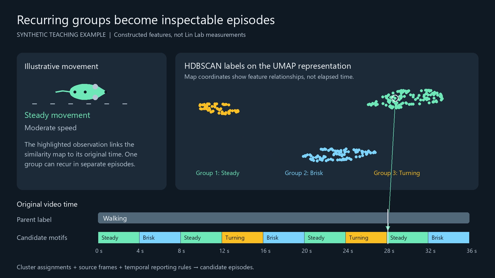{ loading=lazy width=1920 height=1080 }](../assets/images/tab7/concept.webp)
<figcaption>The synthetic example deliberately makes three patterns separable. A group can recur at several times: its points need not form one continuous episode. Map axes describe the feature representation; the timeline supplies time.</figcaption>
</figure>

| Term | Meaning in this workflow |
| --- | --- |
| **Original class** | The Class ID produced by the input model, such as `1: Walking` |
| **Cluster** | A group of similar pose-derived observations within one original class |
| **Observation** | One detected pose on a source frame and track; not an independent animal or a whole clip |
| **Fragment / bout** | A temporal interval formed from successive assignments on a source track; exported bouts must also pass the bout threshold |
| **Reviewed label** | An experimenter's interpretation, stored separately from the algorithm's assignment |

A label such as `1:124` means local cluster `124` inside original Class ID `1`. It is specific to that run. Clusters are candidates for investigation; a visually distinct group or a high HDBSCAN persistence value does not establish a new behavior. HDBSCAN persistence concerns its clustering hierarchy, not how long an episode lasts.

| Input model | What Tab 7 can explore |
| --- | --- |
| Pose model with one animal class | Pose and movement patterns within that class |
| Pose model with behavior Class IDs | Sub-patterns within each predicted behavior |
| Pose model with several animal or object classes | Each Class ID separately; the IDs do not automatically become behavior names |

Tab 7 requires pose outputs. It pools observations across configured sources and groups **within each class**; it does not currently ignore classes to fit one combined partition. Group and subject metadata support interpretation, not feature construction, and group order does not choose a training baseline. The current UMAP/HDBSCAN workflow runs on CPU; it does not train a VAE or fit an HMM.

## 1. Bring existing pose results into Tab 7

| Entry path | Use it when |
| --- | --- |
| **Continue from Latest Tab 6 Run** | You just completed Bout Analytics on pose outputs |
| **Import Analytics Manifest(s)...** | You want to combine completed Tab 6 or batch results |
| **Launch Toolkit for Manual / Raw Sources** | You have pose-directory and video pairs without an analytics run |

The [Batch Processing Wizard](batch-processing-wizard.md) can also send completed results to Tab 7. Manifest schema versions 1–4 are supported. Importing completed results reuses their source paths, metadata, and available setup defaults; it does not require new inference or modify those manifests. Discovery recomputes pose features and cluster bouts. Imported reviewed Tab 6 bout boundaries do not constrain the clustering.

<figure class="plugin-screenshot" markdown>
[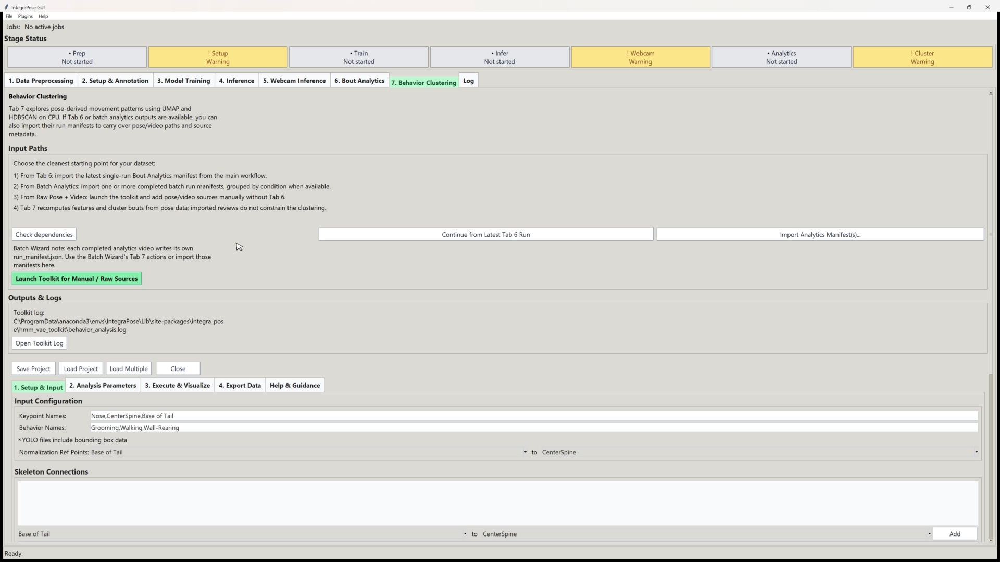{ loading=lazy width=1920 height=1080 }](../assets/images/tab7/setup.webp)
<figcaption>Check the imported setup before running. The tutorial uses Nose, CenterSpine, and Base of Tail in that order, with classes Grooming, Walking, and Wall-Rearing. Its normalization reference runs from Base of Tail to CenterSpine. Use the schema of your own model.</figcaption>
</figure>

In **Setup & Input**, check the following before choosing an output folder:

- Pair each pose directory with its actual source video. Keep keypoint and class names in the order used by the model.
- Check track continuity and use normalization reference points that are meaningful and reliably detected.
- Combine recordings with compatible views, keypoint schemas, and frame rates. Current movement features use frame-based differences; mixed frame rates are not automatically time-normalized.
- Check group and subject identities against the study records. Many frames from one source do not replace independent animals or sessions.
- Review geometry, bounding-box, location, and social feature options. Including absolute image position can make location contribute to the discovered groups.

If dependencies are missing, use **Check dependencies** and follow [Installation](../getting-started/installation.md). The full desktop profile can be installed from the source folder with `pip install ".[plugins]"`; clustering does not require a separate GPU-library installation.

## 2. Choose parameters and run discovery

Three settings that sound similar answer different questions: how much support a cluster needs, which temporal bouts are reported, and how much missing data may separate observations.

<figure class="plugin-screenshot" markdown>
[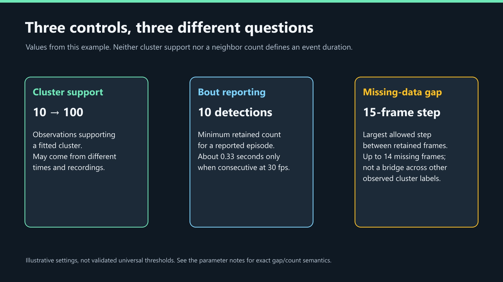{ loading=lazy width=1920 height=1080 }](../assets/images/tab7/parameters.webp)
<figcaption>Cluster support may come from several episodes or recordings. Ten bout detections span about 0.33 seconds only when consecutive at 30 FPS. A maximum frame step of 15 permits up to 14 missing frames; an observed different label still ends the bout.</figcaption>
</figure>

| Setting | What to decide |
| --- | --- |
| **Confidence Threshold** | Which keypoint measurements are reliable enough to contribute; inspect data-health diagnostics for missing measurements |
| **Minimum samples per class** | How many observations a class needs before clustering is attempted; default `30` |
| **HDBSCAN Min Cluster Size** | Minimum cluster membership; default `10`. This is not the requested number of clusters and is not silently lowered |
| **UMAP Neighbors** | Neighborhood size for dimensionality reduction; `0` disables UMAP, otherwise use at least `2` |
| **UMAP Components** | How many reduced dimensions HDBSCAN receives |
| **Max Frame Gap** | Largest frame-index difference allowed between adjacent observations in a bout; also limits continuity when calculating movement features |
| **Min Bout Duration (frames)** | Minimum number of **observed detections** in a retained cluster bout, despite the short GUI label |
| **Run stability audit** | Whether to repeat clustering with several seeds to assess sensitivity |

<figure class="plugin-screenshot" markdown>
[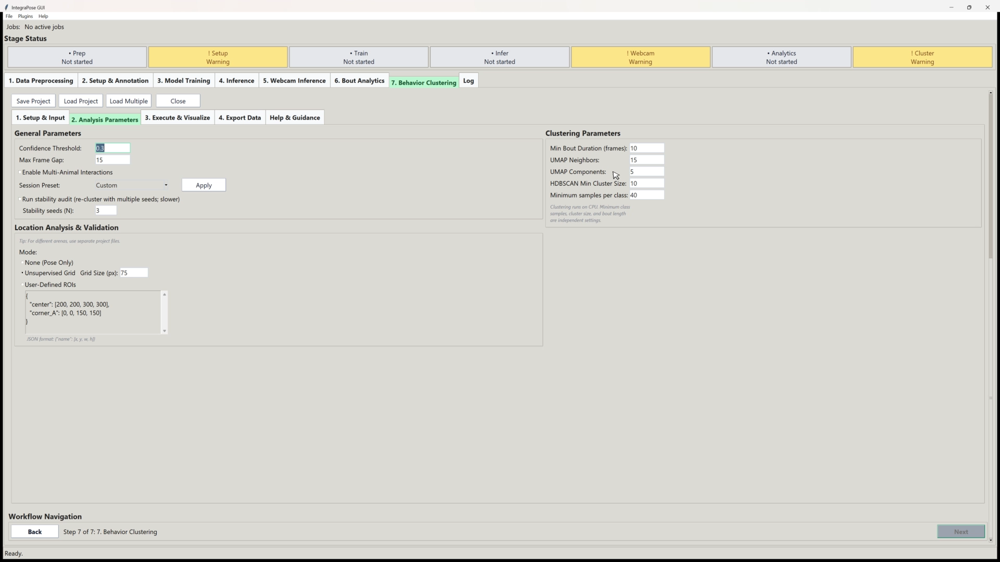{ loading=lazy width=1920 height=1080 }](../assets/images/tab7/controls.webp)
<figcaption>The tutorial's baseline uses confidence 0.3, frame gap 15, bout threshold 10, UMAP neighbors 15, five components, cluster support 10, and minimum class samples 40. These are example choices, not universal recommendations or a list of application defaults.</figcaption>
</figure>

A class must meet both the minimum class-sample and cluster-size requirements. UMAP may also be skipped when a class is too small for the requested neighborhood or dimensionality; the diagnostics record what actually ran. Bout thresholds are independent: frames `100` and `110` have a step of `10` and nine missing frames. A retained interval's `duration_frames` includes its start and end; `detection_count` counts only observations present.

In **Execute & Visualize**, click **Run Sub-Behavior Discovery**. Read **Data Health Summary** and **Sub-Behavior Summary** before interpreting the clusters. These report usable observations, cluster counts, noise, and retained bouts by class.

| `cluster_status` | Interpretation |
| --- | --- |
| `clustered` | HDBSCAN assigned a namespaced cluster label |
| `noise` | HDBSCAN ran but left this observation unassigned |
| `insufficient_samples` | The class did not meet the sample requirements |

Noise and skipped rows both use the legacy label `-1`; use the status column to distinguish them. A skipped class is not evidence that a movement is absent.

## 3. Review a recording in Discovery Explorer { #discovery-explorer }

Click **Open Discovery Explorer** in **Execute & Visualize**. This opens the Qt review window for linked playback, maps, feature comparisons, and annotations. An existing discovery workspace can be reopened without rerunning inference or clustering; see [Save and reopen](#save-and-reopen-a-discovery-project).

Choose a **run, video, track, original Class ID, and cluster** using the top dropdowns. These filter the view; they do not refit the clustering. Review one video/track/class scope at a time. Group names are shown with recordings, but pooled cohort comparison views are not currently available.

### Video & Timeline

<figure class="plugin-screenshot" markdown>
[{ loading=lazy width=1920 height=1080 }](../assets/images/tab7/playback.webp)
<figcaption>Start with the source video and the three aligned lanes. The model may keep predicting Walking while the algorithm assigns several short candidate fragments. An empty reviewed lane means those observations have not yet received human annotations.</figcaption>
</figure>

Select a fragment in the table or click the timeline to seek to its source interval. Play with surrounding context, loop the interval, and inspect other occurrences before deciding what a candidate represents. Playback reads the source video directly; you do not need to export clips first.

The table includes short fragments that the minimum-bout threshold excluded from the original bout CSV. That lets you see flicker and discarded assignments. Bounds are inclusive frame indices; the displayed end time is the exclusive end of the last frame. Blank timeline regions have no observations in the current scope. Gray unassigned observations may be noise or a skipped class; check assignment status.

| Shortcut | Action |
| --- | --- |
| Space | Play or pause |
| Left / Right | Step one source frame |
| P / N | Previous or next fragment |
| Ctrl+Z / Ctrl+Y | Undo or redo a review action |

Playback shortcuts pause while a text-entry field has focus.

### Cluster Explorer

<figure class="plugin-screenshot" markdown>
[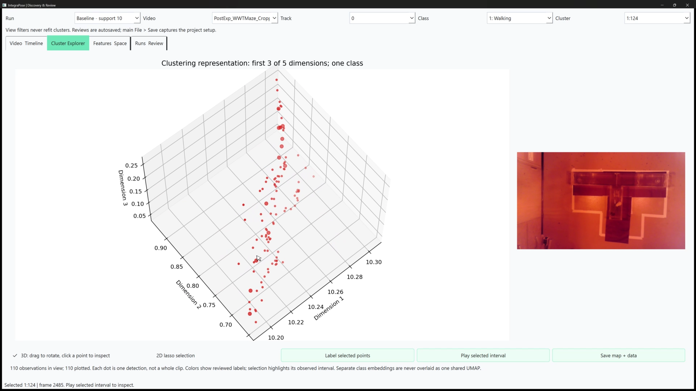{ loading=lazy width=1920 height=1080 }](../assets/images/tab7/map.webp)
<figcaption>Use the map to choose observations to watch. This tutorial run clustered in five dimensions; the 3D display shows only the first three. Apparent separation here is a reason to inspect the candidate, not a behavior label.</figcaption>
</figure>

Rotate the 3D view or switch to 2D. Selecting a point opens its containing fragment and plays it in the adjacent preview. For a single class with retained coordinates, the map shows up to three dimensions of the representation used for clustering. If coordinates are unavailable or several classes are displayed, it explicitly uses a PCA projection of the unscaled input features. Separately fitted class embeddings do not share one UMAP space.

The caption reports displayed and eligible counts; the map shows at most **15,000 deterministically sampled observations**. A 2D lasso selects only displayed points. **Label selected points** makes an explicit manual split or reassignment; it does not recluster a subset.

## 4. Compare what the candidates are doing { #features-space }

In **Features & Space**, select clusters A and B and a feature from the dataset-derived list. Use distributions to compare values, then return to playback to understand what produced those values. The feature list follows your dataset rather than assuming a fixed skeleton or behavior vocabulary. The **Feature** selector chooses the measured value for feature plots; the separate **Keypoint** selector applies to trajectories and dwell heatmaps.

<figure class="plugin-screenshot" markdown>
[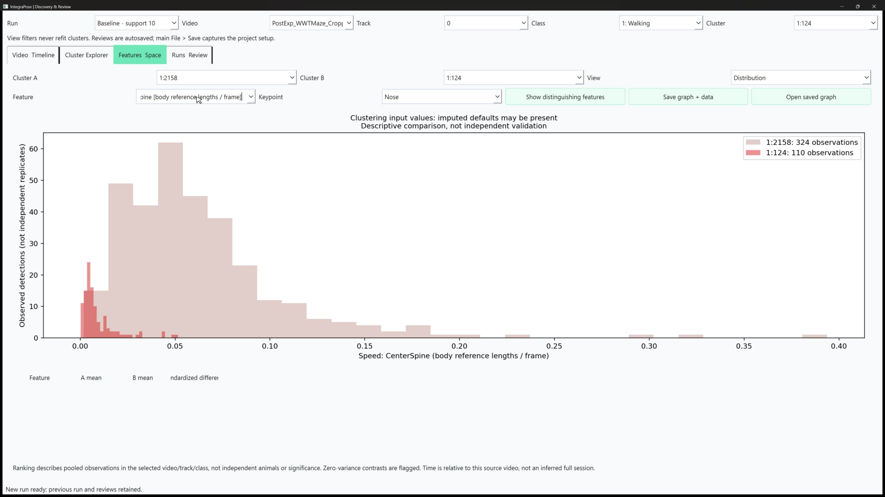{ loading=lazy width=1920 height=1080 }](../assets/images/tab7/features.webp)
<figcaption>The tutorial compares CenterSpine speed in body-reference lengths per source frame. A difference can help describe these selected observations; it is not independent confirmation because these are features used in clustering.</figcaption>
</figure>

| View | Use it to inspect | Read it with this context |
| --- | --- | --- |
| Distribution | Differences in the selected feature's values | Observations can be correlated and include imputed defaults |
| Source-video time | When a candidate occurs or a feature changes | Time refers to this recording; offsets into an original session are not inferred |
| Time relative to interval start | How values evolve after a selected interval begins | The start is your selected interval, not an inferred event or ROI entry |
| Normalized fragment progress | Shape across intervals of different lengths | This removes absolute-duration differences |
| Trajectory / dwell heatmap | Where tracked keypoints move or accumulate observed time | Gaps remain missing; paired heatmaps share a color scale |
| Occupancy | A candidate's share of observed track time in five-second bins | Denominator is the current class scope, including noise; no observations means missing, not zero |

**Show distinguishing features** ranks absolute mean differences divided by pooled within-cluster standard deviation. It is a descriptive comparison in the selected scope, not causal importance or a significance test. Zero-variance comparisons are flagged. Inspect Data Health Summary because the plotted clustering inputs can contain imputed values for missing or low-confidence measurements.

Speed is currently frame-based, not calibrated physical speed per second. Time-course lines and trajectories do not bridge missing frames. Dwell time sums valid-keypoint observations divided by source FPS, without filling missing frames. Save the interpretation along with the graph using [Save graph + data](#export-reviewed-assignments).

### Worked example: faster and slower Walking candidates

<figure class="plugin-screenshot" markdown>
[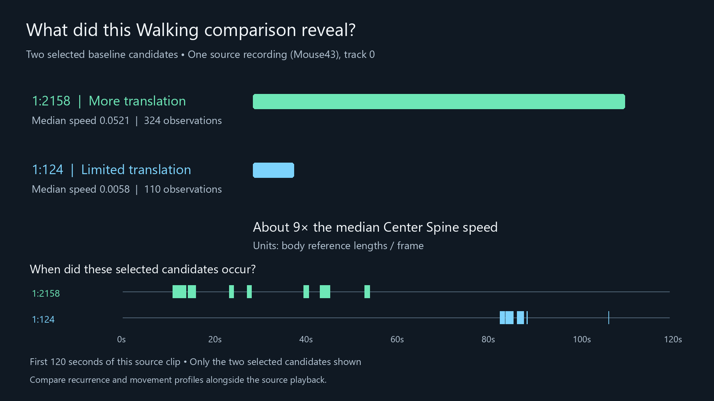{ loading=lazy width=1920 height=1080 }](../assets/images/tab7/findings.webp)
<figcaption>In one Mouse43 source recording and track 0, candidate 1:2158 has 324 observations and median speed 0.0521; candidate 1:124 has 110 observations and median speed 0.0058. The approximately ninefold difference is descriptive for this selection. The raster preserves gaps between occurrences.</figcaption>
</figure>

Playback and the feature comparison support describing these selected candidates as having different amounts of translation. They do not establish two new behaviors, an animal-level difference, or a treatment effect. The original Walking prediction may itself need review during limited movement. The tutorial workspace combines 39 sources, but its imported subject labels do not identify independent animals reliably; verify metadata before using subject coverage as evidence of replication.

## 5. Record your interpretation { #experimenter-annotations }

<figure class="plugin-screenshot" markdown>
[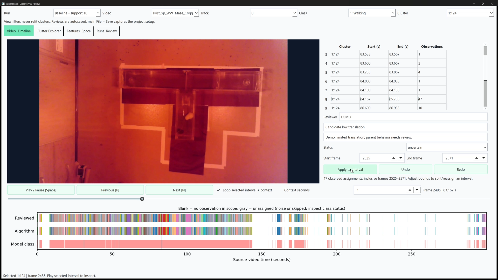{ loading=lazy width=1920 height=1080 }](../assets/images/tab7/review.webp)
<figcaption>The tutorial demonstrates a cautious annotation: Candidate low translation, marked uncertain, with a reason that the parent behavior needs review. The selected inclusive interval contains 47 observations. DEMO is a tutorial reviewer label.</figcaption>
</figure>

Enter reviewer initials, a descriptive label, and an optional reason. Check the start/end frames and review status before selecting **Apply to interval**. This applies to observed rows in the chosen video/track/class interval, **including other clusters inside those bounds**. Unobserved frames are not invented. A new name can split an interval; an existing name can reassign observations to an already reviewed category.

Statuses are **reviewed**, **uncertain**, **artifact**, and **excluded**. They remain in exports. Marking an observation excluded does not delete it or automatically remove it from descriptive graphs; downstream analysis must apply the intended inclusion policy.

**Merge A into B (current scope)** affects the selected video, track, and class after confirmation. Original algorithmic labels remain unchanged. Review history records initials, time, reason, affected observations, and undo/redo state. A new edit after undo supersedes the old redo branch while retaining its history.

## 6. Compare runs and keep the project { #managed-runs-and-project-saving }

Use **Runs & Review** to rename runs, archive or restore them, inspect storage, and compare assignments. Run comparisons align observations by source, track, and frame, report overlap, and calculate Adjusted Rand Index (ARI) on original labels, including noise. Cluster IDs are local to a run, and human labels are not transferred to another run automatically.

<figure class="plugin-screenshot" markdown>
[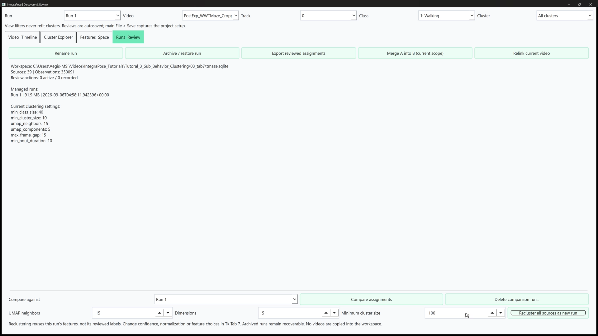{ loading=lazy width=1920 height=1080 }](../assets/images/tab7/run-controls.webp)
<figcaption>Keep the baseline and create a named comparison. The Qt reclustering controls reuse retained features across all sources and let you change UMAP neighbors, dimensions, and minimum cluster size.</figcaption>
</figure>

Qt reclustering runs in the background and refits the representation and clustering from the retained feature matrix. To change feature construction, confidence, normalization, or bout settings, close the Explorer and make a new feature run in Tab 7.

<figure class="plugin-screenshot" markdown>
[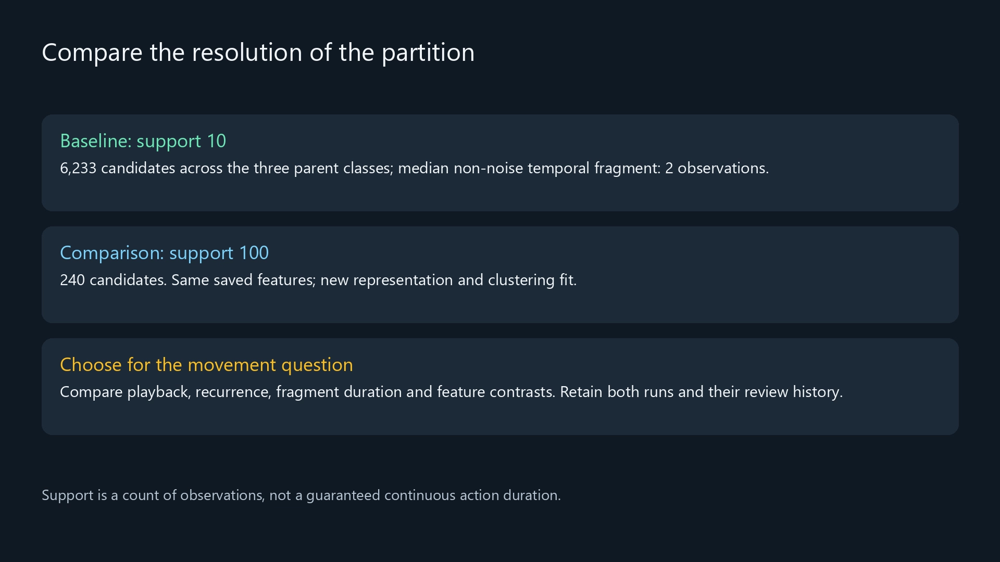{ loading=lazy width=1920 height=1080 }](../assets/images/tab7/runs.webp)
<figcaption>The tutorial's baseline produced 6,233 candidates and a median non-noise temporal fragment of only two observations. Its full comparison run at support 100 produced 240 candidates. Fewer candidates alone do not identify the better analysis; inspect recurrence, duration, noise, features, and playback.</figcaption>
</figure>

If you enabled **Run stability audit**, inspect pairwise ARI across seeds alongside noise and cluster counts. The **Stable / Unstable** badge uses mean ARI `0.5` as an interface heuristic; identical all-noise results can also agree. Seed agreement does not test every parameter choice, biological validity, or generalization to new animals.

Archiving is reversible and does not free storage. To permanently remove a run and its review history, select another active run and use **Delete comparison run...**, then confirm. This never deletes source videos.

### Save and reopen a discovery project

The Explorer autosaves reviews and checkpoints its view state in a SQLite workspace. Main **File > Save**, or the embedded toolkit's **Save Project**, saves the Tab 7 setup and workspace reference in the project JSON. Autosaved reviews are not rolled back to the last JSON save.

1. Close the Explorer before first main-project save, **Save As**, or loading another project.
2. Save the project. On first save or **Save As**, the workspace is copied to `<project-name>.discovery.sqlite` beside the JSON so separate projects do not edit the same review database.
3. Later, select **Load Project** and choose that project JSON. Check restored groups and source count.
4. Select **Open Discovery Explorer** to return to stored runs, reviews, and the saved view: active run, video, selection, time, filters, and graph controls.

**Load Project** accepts current main-app projects and legacy Tab 7-only projects. Main projects restore their other saved tabs too; legacy projects restore discovery setup. Diagnostics and analysis-summary JSON files are not projects. Old CSV-only results need a discovery run from original pose outputs to populate a workspace, but not new YOLO inference.

Keep the JSON and database together. Source videos remain referenced files, so **Save As is not a portable packaging operation**. A missing workspace prompts for relinking. **Relink current video** checks frame count and FPS; confirm that the replacement is the same recording.

## 7. Export an inspectable result { #export-reviewed-assignments }

<figure class="plugin-screenshot" markdown>
[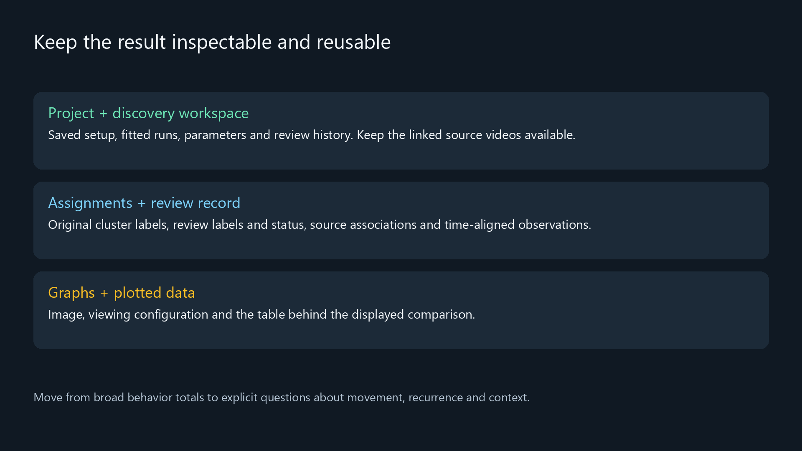{ loading=lazy width=1920 height=1080 }](../assets/images/tab7/outputs.webp)
<figcaption>Keep enough context to reopen the analysis, identify what was reviewed, and recover the values behind a figure. A screenshot alone cannot preserve those records.</figcaption>
</figure>

| What you want to keep | Action / files |
| --- | --- |
| Reopen setup, runs, and reviews | **Save Project**; retain the project JSON, discovery SQLite workspace, and referenced source files |
| Current human-reviewed assignments | **Runs & Review > Export reviewed assignments**; retain the CSV and matching `.review.json` |
| A feature figure and its values | **Save graph + data**; retain the image, configuration/provenance JSON, and plotted-data CSV |

**Export reviewed assignments includes all observations in the selected run**, across sources, tracks, and classes. View filters do not limit its rows. The CSV preserves source/frame identity, original `cluster_label` and `cluster_status`, and effective `review_label` and `review_status`. Unreviewed rows retain their original cluster label and have status `unreviewed`; uncertain, artifact, and excluded rows remain present. Filter statuses explicitly for downstream use.

The companion `.review.json` records the run ID, source metadata, and review history. Export again after further edits for a current snapshot. **Open saved graph** restores a graph configuration; if reviews have changed, it asks before regenerating with current annotations. The earlier plotted-data CSV remains the record of the earlier graph.

??? info "Conventional Tab 7 exports, naming, and clips"
    The setup window's conventional reports live under `latest_exports/` and describe the **last Tk analysis run**. Explorer reruns and human edits do not automatically update them. The older naming and clip tools also operate on that last Tk run, not the Qt review layer.

    | File | Contents |
    | --- | --- |
    | `sub_behavior_per_frame.csv` | Source identity, original classes, cluster labels, assignment and CPU execution status |
    | `sub_behavior_bouts.csv` | Source/track, labels, status, inclusive bounds, interval span, and detection count |
    | `sub_behavior_feature_diagnostics.json` | Feature checks, settings, actual reduction, seed, and package versions |
    | `sub_behavior_summary.txt` | Per-class counts and run identifier |
    | `sub_behavior_candidate_scores.csv` | Candidate rankings, component measurements, advisory verdicts, and notes when scoring completes |
    | `sub_behavior_stability.json` | Results when the optional seed audit completes |
    | `sub_behavior_run_id.txt` | Current conventional run identifier |
    | `state_names.json` | Names saved through the legacy naming dialog |
    | `sub_cluster_clips/` | Optional clips and `clip_manifest.csv` with source-frame provenance |

    **Review Candidate Sub-Clusters** ranks candidates using size, subject coverage, duration, and available stability information. Its *Likely real / Review / Likely noise* wording is advisory, not a probability or significance test.

    **Name Sub-Behaviors...** shows three frames per bout from up to nine longest bouts. Enter a name and select **Save & Next**. Also inspect short and ambiguous intervals; longest bouts are a selected sample.

    **Export Sub-cluster Clips** runs only when requested. Clips use names from that naming dialog or a class/sub-cluster fallback. Check `clip_manifest.csv` for skipped clips. These exports do not contain the Explorer's effective review labels.

Before using curated assignments for training, review their suitability and split data by appropriate animals or sessions so related clips do not leak across splits. These outputs are neither a complete full-video annotation nor automatically validated training labels.

## Troubleshooting and current boundaries { #current-boundaries }

| Symptom | What to check |
| --- | --- |
| A class is skipped | Observation count against both minimum sample settings; collect representative data rather than lowering thresholds just to force a result |
| Most observations are noise | Pose quality, normalization, features, and sampling before parameter tuning; there is no universal target assigned fraction |
| Many clusters but few retained bouts | Per-frame assignments, track continuity, gaps, and minimum detection count |
| Clusters change after a rerun | Parameters and seed sensitivity; IDs and reviewed names are not interchangeable across runs |
| Missing clips or thumbnails | Source-video mappings and clip-export manifest |
| Load Project rejects JSON | Choose a main or legacy Tab 7 project; use **Import Analytics Manifest(s)...** for manifests |
| Explorer will not open | The reported interpreter and startup log; check the Qt runtime in that environment |

Event/ROI-entry alignment, original-session offsets, cohort aggregation, subset reclustering, automatic annotation transfer, a full portable-project export, and dedicated synchronized cross-run playback are not currently implemented. Human-reviewed annotations informed by clustering should be reported as such.

## Tutorial image credits

Images are extracted from **Tutorial 3: Sub-Behavior Clustering**, including its T-maze discovery review cut, GUI recordings, and explanatory cards. T-maze footage and data are credited to the **Lin Lab, University of Maryland, Baltimore County (UMBC)**. The synthetic Walking illustration is a teaching example; the T-maze figures report the tutorial's existing analysis, not a new run performed for this documentation.
